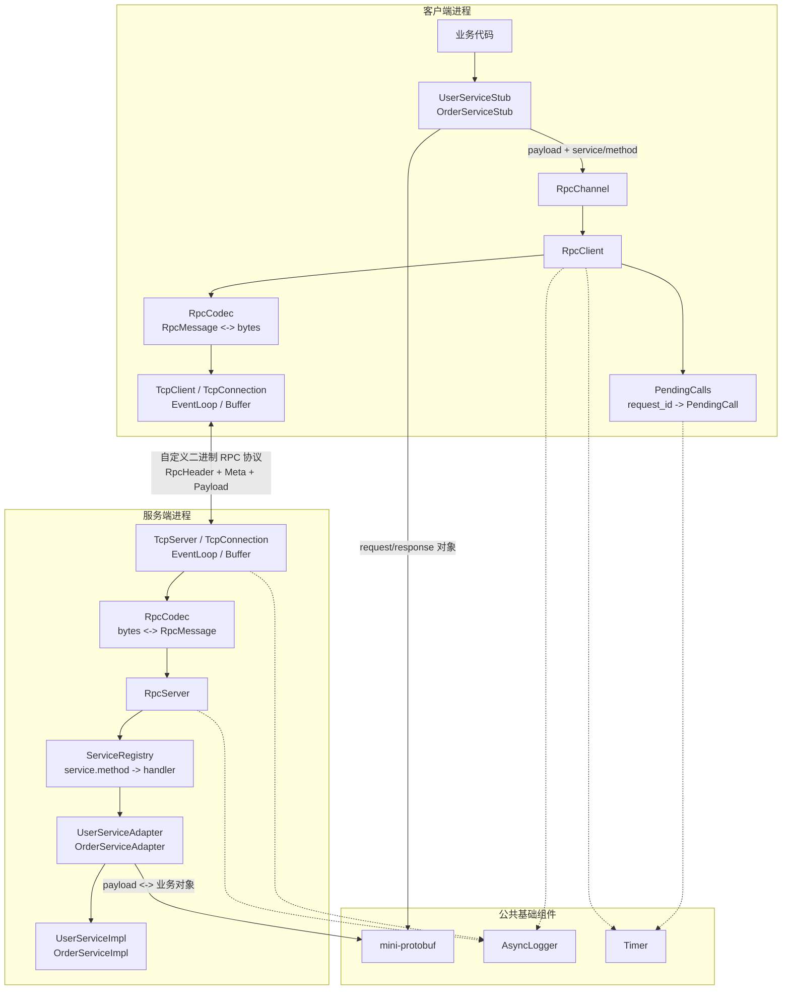
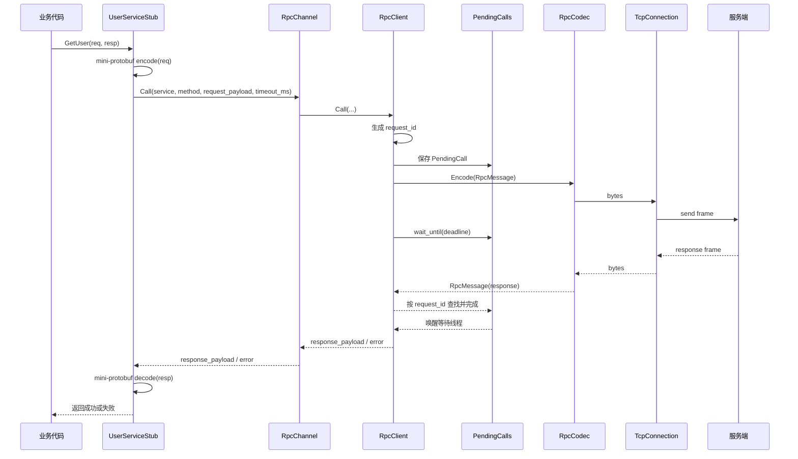
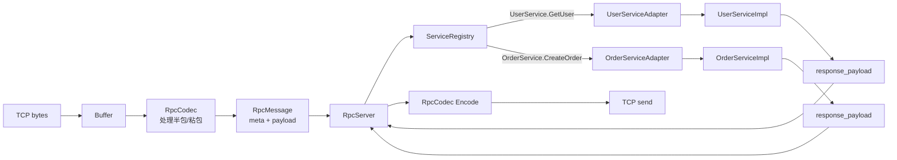

# mini-rpc 设计文档

## 1. 版本目标

`mini-rpc` 第一版只做一件事：把一次 C++ 本地方法调用，变成一次基于 TCP 的远程请求和响应。

第一版范围：

1. 自定义 RPC 二进制协议。
2. 支持 `request_id` 请求响应匹配。
3. 支持同步调用。
4. 支持超时控制。
5. 支持服务端方法注册和分发。
6. 支持 `mini-protobuf` 序列化。
7. 接入 `AsyncLogger`。
8. 提供 `UserService` / `OrderService` 示例。

第二版范围：

1. 异步调用。
2. 连接复用。
3. 连接池。
4. 服务发现。
5. 轮询负载均衡。
6. 失败重试。
7. metrics 统计。
8. 压测报告。

第三版范围：

1. HTTP 网关。
2. 配置中心。
3. 健康检查。
4. 服务注册中心。
5. 管理页面。
6. `trace_id` 链路追踪。

后续版本的能力可以在第一版里预留字段或接口，但不能让第一版实现变复杂。第一版的边界是：单连接、同步 unary RPC、明确错误、能跑通两个示例服务。

## 2. 对标标准

`mini-rpc` 可以参考 gRPC 和 brpc 的设计思想，但第一版不能直接复制它们的完整功能。对标的重点不是“功能列表一样多”，而是第一版的核心结构不能写死，后续能自然演进。

第一版需要吸收的思想：

1. 像 gRPC 一样，把一次调用抽象成 `Stub -> Channel -> Transport`，业务代码不直接碰网络。
2. 像 gRPC 一样，有明确的 `status_code/error_text/deadline`，不要只返回 `true/false`。
3. 像 gRPC 一样，把服务名、方法名、超时、错误等元信息放在 meta，业务 request/response 放在 payload。
4. 像 brpc 一样，重视高并发下的连接、Buffer、日志、超时和可观测性边界。
5. 像 brpc 一样，把服务注册、方法分发、请求上下文、日志统计做成框架能力，而不是业务自己拼。

第一版不追求的能力：

1. 不实现 HTTP/2。
2. 不实现真正的流式 RPC。
3. 不实现 bthread/coroutine 风格调度。
4. 不实现 naming service、负载均衡、失败重试。
5. 不实现完整 metrics 和 tracing。

第一版要留下的扩展点：

1. `version/flags/codec`：协议升级、压缩、不同序列化格式。
2. `status_code/error_text`：统一错误模型。
3. `timeout_ms`：deadline 语义。
4. `request_id`：同步、异步、并发请求的基础。
5. `RpcChannel`：以后支持异步调用、连接池、负载均衡时，Stub 不需要改。
6. `ServiceRegistry`：以后接入服务发现或管理页面时，不改业务实现。
7. `AsyncLogger`：后续 metrics、trace、压测数据都可以从统一事件继续扩展。

所以第一版代码要简单，但边界要像真正框架：业务对象不进入调用层，网络层不理解 RPC 方法，协议层不做业务反序列化。

## 3. 先理解 RPC 要解决什么

普通本地调用是：

```text
User user = user_service.GetUser(1001);
```

RPC 要伪装成类似的调用，但实际发生的是：

```text
客户端:
  GetUserRequest
  -> 序列化成 payload
  -> 加 RPC 头和方法名
  -> 通过 TCP 发出去

服务端:
  从 TCP 收 bytes
  -> 拆出一条完整 RPC 消息
  -> 找到 UserService.GetUser
  -> 反序列化 request
  -> 调用本地业务方法
  -> 序列化 response
  -> 通过 TCP 发回去

客户端:
  收到 response
  -> 用 request_id 找到原来的调用
  -> 反序列化 response
  -> 返回给调用者
```

所以第一版最重要的边界不是功能多少，而是每层只解决自己的问题。

## 4. 第一版分层

```text
业务层
  UserServiceImpl / OrderServiceImpl

RPC 接口层
  UserServiceStub / OrderServiceStub
  UserServiceAdapter / OrderServiceAdapter

RPC 调用层
  RpcClient / RpcServer / RpcChannel / ServiceRegistry / PendingCalls

序列化层
  mini-protobuf

协议层
  RpcMessage / RpcCodec / RpcHeader

网络层
  TcpClient / TcpServer / TcpConnection / EventLoop / Buffer

基础组件
  AsyncLogger / Timer
```

第一版不要把层次做成很多抽象类。可以先用清晰的类名和单向依赖保证边界。

### 4.1 总体架构图



这张图里最重要的是三条边界：

1. `Stub/Adapter` 负责业务对象和 payload 的转换。
2. `RpcClient/RpcServer` 只处理 `service_name/method_name/request_id/status/payload`。
3. `RpcCodec/网络层` 只处理二进制 frame 和 TCP 字节流，不理解业务类型。

## 5. 第一版完整调用链路

客户端同步调用：

```text
UserServiceStub::GetUser(req, resp)
  -> mini-protobuf encode(req) 得到 request_payload
  -> RpcChannel::Call("UserService", "GetUser", request_payload)
  -> RpcClient 生成 request_id
  -> PendingCalls 保存 request_id 对应的等待对象
  -> RpcCodec encode 成二进制 frame
  -> TcpConnection send
  -> 当前调用线程等待 response 或 timeout
```

客户端收到响应：

```text
TcpConnection on_read
  -> Buffer 追加 bytes
  -> RpcCodec 从 Buffer 中拆出完整 RpcMessage
  -> RpcClient 用 response.request_id 找 PendingCall
  -> 填入 response_payload 或错误码
  -> 唤醒同步等待线程
  -> Stub decode(response_payload) 得到业务 response
```

服务端处理请求：

```text
TcpConnection on_read
  -> RpcCodec decode 得到 RpcMessage
  -> RpcServer 交给 ServiceRegistry
  -> 找到 UserServiceAdapter.GetUser
  -> Adapter decode(request_payload)
  -> 调用 UserServiceImpl::GetUser
  -> Adapter encode(response)
  -> RpcServer 构造 response RpcMessage
  -> RpcCodec encode
  -> TcpConnection send
```

这里 `Stub/Adapter` 是业务类型和 RPC 通用层之间的边界。`RpcClient/RpcServer` 不应该知道 `GetUserRequest`、`CreateOrderRequest` 这种具体类型。

### 5.1 客户端同步调用图



这张图对应第一版的“同步调用”。同步不是说网络层必须阻塞，而是调用线程会等待 `PendingCall` 被响应、超时或连接断开唤醒。

### 5.2 服务端分发图



服务端分发的关键是 `ServiceRegistry`。它只根据字符串定位 handler，不关心业务对象结构；业务对象的解码和编码留给对应的 Adapter。

## 6. 自定义二进制协议

### 6.1 为什么需要协议层

TCP 是字节流，不是消息队列。一次 `send` 不等于一次 `recv`：

1. 半包：发送一条 RPC 消息，接收方第一次只读到一半。
2. 粘包：连续发送两条 RPC 消息，接收方一次读到了两条。
3. 拆包 + 粘包：接收方读到第一条的后半段和第二条的前半段。

协议层的任务就是从 TCP 字节流里稳定地拆出一条条完整的 `RpcMessage`。

### 6.2 Frame 格式

第一版采用固定头 + meta + payload：

```text
+-------------+-------------+---------------+
| RpcHeader   | Meta bytes  | Payload bytes |
+-------------+-------------+---------------+
```

固定头建议：

```text
uint32 magic        // 固定值，例如 0x4d525043，表示 "MRPC"
uint8  version      // 当前deadline协议为 2
uint8  message_type // REQUEST 或 RESPONSE
uint8  codec        // 第一版为 MINI_PROTOBUF
uint8  flags        // 第一版填 0，后续可表示压缩、校验、trace 等扩展
uint64 request_id   // 请求响应匹配
uint32 meta_len     // meta 字节数
uint32 payload_len  // payload 字节数
```

这个头是 24 字节。实现时不要直接 `reinterpret_cast<RpcHeader*>`，而是手动按网络字节序读写每个字段。

`meta` 放 RPC 元信息，第一版可以用 mini-protobuf 编码：

```text
service_name
method_name
status_code
error_text
deadline_us
```

`payload` 放业务请求或响应，也用 mini-protobuf 编码。

协议设计要注意：

1. 固定头字段不能随意删除或改语义，只能通过 `version/flags` 演进。
2. `meta_len + payload_len` 必须有最大值限制，避免恶意大包拖垮内存。
3. 发送前尽量一次性拼好 frame，减少多次小写入。
4. 解码时尽量在 `Buffer` 上移动读指针，不做不必要拷贝。
5. 第一版可以简单实现，但接口上不要把协议和业务对象绑死。

### 6.3 request 和 response

请求：

```text
message_type = REQUEST
request_id = 客户端生成
meta.service_name = "UserService"
meta.method_name = "GetUser"
meta.status_code = OK
payload = GetUserRequest 的序列化结果
```

响应：

```text
message_type = RESPONSE
request_id = 原样带回
meta.status_code = OK 或错误码
meta.error_text = 错误信息，可为空
payload = GetUserResponse 的序列化结果，失败时可为空
```

### 6.4 解码规则

`RpcCodec` 只从 `Buffer` 里产出完整消息：

```text
while buffer.readable_bytes >= header_size:
    读取但不移除 header
    检查 magic/version/message_type
    total_len = header_size + meta_len + payload_len
    如果 total_len 超过 max_frame_size，返回协议错误
    如果 buffer.readable_bytes < total_len，说明半包，等待下一次 read
    移除 header + meta + payload
    组装 RpcMessage
    交给上层
```

粘包不用单独处理，因为 `while` 循环会持续拆完整消息。

### 6.5 协议层边界

协议层负责：

1. `RpcMessage <-> bytes`。
2. magic、version、长度、最大包校验。
3. 处理半包和粘包。

协议层不负责：

1. 查找服务和方法。
2. 反序列化业务对象。
3. 生成 `request_id`。
4. 实现超时。

## 7. RPC 调用层

调用层负责“请求响应语义”。

核心类：

```text
RpcClient
RpcServer
RpcChannel
PendingCalls
ServiceRegistry
```

### 7.1 RpcChannel

`RpcChannel` 是 Stub 依赖的通用接口：

```cpp
class RpcChannel {
public:
    bool Call(const std::string& service_name,
              const std::string& method_name,
              const std::string& request_payload,
              std::string* response_payload,
              int timeout_ms);
};
```

它不接收业务对象，只接收序列化后的 payload。

### 7.2 PendingCalls

客户端发出请求后，需要记录还没完成的调用：

```text
request_id -> PendingCall
```

`PendingCall` 至少包含：

```text
request_id
deadline
response_payload
status_code
error_text
mutex / condition_variable
done
```

边界：

1. 发送前加入 pending map。
2. 收到响应后按 `request_id` 查找并移除。
3. 超时后也要移除。
4. 迟到响应找不到 pending call，直接丢弃并写日志。
5. 连接断开时，把所有 pending call 标记为失败。

### 7.3 同步调用

第一版只提供同步调用：

```text
Call()
  -> 发送请求
  -> 等待 condition_variable
  -> 收到响应返回 true
  -> 超时或错误返回 false
```

这里的网络 IO 仍然可以是事件驱动的；“同步”只是用户调用线程会阻塞等待结果。

### 7.4 超时控制

超时由调用层发起，网络层的 `TimerQueue` 负责定时唤醒，协议层携带绝对 `deadline_us`。

客户端：

1. `Call` 开始时计算 deadline。
2. 等待 response 时最多等到 deadline。
3. 超时后从 pending map 删除。
4. 返回 `TIMEOUT`。
5. Retry始终复用第一次计算出的总deadline，不能重新计算超时时间。

服务端在分发业务方法前检查deadline，已经过期的请求直接返回 `TIMEOUT`。已经开始执行的业务方法暂不支持强制取消；客户端收到迟到响应后丢弃。

### 7.5 调用层性能边界

调用层是后续性能优化的核心位置，第一版需要先避免明显错误：

1. `request_id` 使用单调递增的 `uint64`，避免锁粒度过大。
2. `PendingCalls` 的 map 操作要有明确锁保护，插入、删除、超时清理不能竞态。
3. 同步等待不能阻塞 IO 线程，只能阻塞发起调用的业务线程。
4. 收到响应后要尽快从 pending map 移除，避免长期占用内存。
5. 超时和连接断开都必须唤醒等待线程，不能让调用永久挂住。

## 8. 服务注册和分发

服务端需要把字符串方法名映射到真正的业务处理函数。

```text
ServiceRegistry
  "UserService.GetUser"       -> UserServiceAdapter::GetUser
  "OrderService.CreateOrder"  -> OrderServiceAdapter::CreateOrder
```

建议第一版用显式注册：

```cpp
server.Register("UserService", "GetUser", handler);
server.Register("OrderService", "CreateOrder", handler);
```

handler 统一签名：

```cpp
using RpcHandler = std::function<bool(
    const std::string& request_payload,第一版
1. 自定义 RPC 二进制协议
2. 支持 request_id 请求响应匹配
3. 支持同步调用
4. 支持超时控制
5. 支持服务端方法注册和分发
6. 支持 mini-protobuf 序列化
7. 接入 AsyncLogger
8. 提供 UserService / OrderService 示例
第二版
异步调用
连接复用
连接池
服务发现
轮询负载均衡
失败重试
metrics 统计
压测报告
第三版
HTTP 网关
配置中心
健康检查
服务注册中心
管理页面
trace_id 链路追踪

    std::string* response_payload,
    std::string* error_text)>;
```

`UserServiceAdapter` 负责：

```text
request_payload -> GetUserRequest
调用 UserServiceImpl
GetUserResponse -> response_payload
```

这样 `RpcServer` 只知道 payload，不知道业务类型。

复用性要求：

1. `RpcClient/RpcServer/RpcCodec/ServiceRegistry` 不能包含 `User` 或 `Order` 字样。
2. 示例服务只能出现在 `example` 或 `services` 目录，不能反向污染框架核心。
3. 框架层只依赖通用结构：`service_name/method_name/request_id/meta/payload/status`。
4. 业务适配器负责类型转换，框架只负责传输、匹配、分发和错误。
5. 后续新增 `ProductService` 时，只应该新增业务 message、stub、adapter 和注册代码，不应该修改 RPC 核心类。

## 9. mini-protobuf 序列化边界

第一版所有业务 request/response 都使用 `mini-protobuf`：

```text
GetUserRequest
GetUserResponse
CreateOrderRequest
CreateOrderResponse
```

序列化层负责：

1. 业务对象编码成 bytes。
2. bytes 解码成业务对象。
3. 字段缺失、未知字段、类型错误的处理。

序列化层不负责：

1. TCP 收发。
2. RPC 方法分发。
3. `request_id` 匹配。
4. 超时。

客户端序列化失败：请求不发送，直接返回本地错误。

服务端反序列化失败：返回 `DECODE_ERROR` 响应。

## 10. 网络和性能边界

第一版不做极限优化，但要避免以后推倒重来。

网络层原则：

1. IO 线程只负责读写、Buffer、协议编解码，不执行耗时业务。
2. 业务方法可以先在 IO 线程串行调用以降低实现难度，但代码边界上要能迁移到线程池。
3. `TcpConnection::Send` 应该接受完整 bytes，由网络层处理写缓冲和非阻塞写。
4. `Buffer` 要支持 append、peek、retrieve，协议层不能直接操作裸 fd。
5. 连接关闭必须通知调用层清理 pending call。

性能原则：

1. 控制拷贝次数：业务对象只序列化一次，response 只反序列化一次。
2. 控制内存：设置 `max_frame_size`、`max_meta_size`、`max_payload_size`。
3. 控制阻塞：日志使用 `AsyncLogger`，不要在 IO 路径同步刷盘。
4. 控制锁范围：pending map 加锁只包住查找和状态修改，不包住网络发送和业务执行。
5. 控制小包写：`RpcHeader + meta + payload` 尽量合并后发送。

这些要求不会让第一版功能变多，但会影响类的职责划分，决定后续能不能扩展到连接池、异步调用和压测。

## 11. AsyncLogger 接入点

第一版不需要复杂可观测性，但关键事件要打日志：

1. 服务启动、监听地址。
2. 新连接、连接关闭。
3. 请求到达：`request_id/service/method/payload_size`。
4. 响应发送：`request_id/status/latency_ms`。
5. 超时：`request_id/service/method/timeout_ms`。
6. 协议错误：magic/version/length 错误。
7. 分发错误：服务不存在、方法不存在。
8. 编解码错误。

日志层只记录事件，不反向影响 RPC 流程。不要让业务层依赖 `AsyncLogger`，由框架层记录公共日志。

## 12. 错误码

第一版错误码保持小而明确：

```text
OK
TIMEOUT
CONNECT_ERROR
CONNECTION_CLOSED
PROTOCOL_ERROR
DECODE_ERROR
ENCODE_ERROR
SERVICE_NOT_FOUND
METHOD_NOT_FOUND
INVOKE_ERROR
INTERNAL_ERROR
```

错误传播规则：

1. 本地错误不发送请求，例如请求序列化失败。
2. 服务端可恢复错误返回 RESPONSE，`status_code != OK`。
3. 协议不可恢复错误可以关闭连接。
4. 连接断开导致所有 pending call 失败。

## 13. UserService / OrderService 示例

第一版示例服务只需要证明框架通用，不需要复杂业务。

`UserService`：

```text
GetUser(user_id) -> user_name, age
```

`OrderService`：

```text
CreateOrder(user_id, item_id, count) -> order_id, status
GetOrder(order_id) -> user_id, item_id, count, status
```

示例要覆盖：

1. 同一个 `RpcClient` 调不同服务。
2. 不同方法使用不同 request/response 类型。
3. 服务不存在和方法不存在。
4. 超时。
5. 半包、粘包协议测试。

## 14. 第一版边界清单

必须做：

1. 一个已建立的 TCP 连接上，允许存在多个未完成请求，并通过 `request_id` 正确匹配响应。
2. `RpcCodec` 正确处理半包、粘包。
3. 同步调用支持超时。
4. 服务端支持注册和分发多个服务方法。
5. request/response 使用 mini-protobuf。
6. 关键事件接入 AsyncLogger。
7. UserService / OrderService 跑通。
8. 预留协议版本、flags、codec、status、timeout 等扩展点。
9. 设置最大包大小和 pending call 清理规则。

明确不做：

1. 异步调用 API。
2. 连接池。
3. 服务发现。
4. 负载均衡。
5. 失败重试。
6. HTTP 网关。
7. 注册中心。
8. 管理页面。
9. 链路追踪。

## 15. 推荐实现顺序

按这个顺序实现，风险最低：

1. `RpcHeader/RpcMessage/RpcCodec`，先写半包、粘包、非法长度测试。
2. `mini-protobuf` 接入业务 request/response。
3. `ServiceRegistry`，先不用网络，直接测试服务分发。
4. `RpcClient/RpcServer` 跑通单个 `UserService.GetUser`。
5. 加 `request_id` 和 `PendingCalls`。
6. 加同步等待和超时。
7. 接入 `AsyncLogger`。
8. 加 `OrderService` 示例。
9. 补齐错误码和边界测试。

第一版完成的标准：本机启动 server，client 能同步调用 `UserService` 和 `OrderService`，能看到日志，能证明半包粘包、超时、服务不存在、方法不存在都被正确处理。
